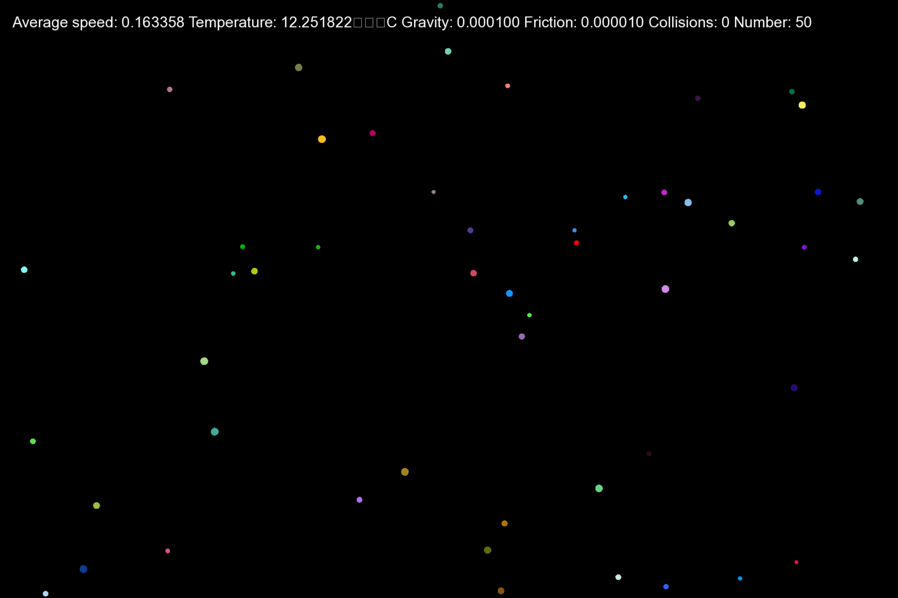

SFML Ball Simulation

A simple C++ program that simulates the movement and collisions of multiple circles (balls) within a fullscreen window using the SFML (Simple and Fast Multimedia Library). This simulation includes basic physics concepts like gravity, air resistance, and elastic collisions with both walls and other balls, giving a rudimentary visual representation of a kinetic gas model, where the average speed is related to a simulated "temperature."

Prerequisites

To compile and run this program, you will need:

    A C++ Compiler (e.g., g++, Clang, MSVC).

    The SFML Library (version 2.5 or later is recommended).

    A working arial.ttf font file in the same directory as the executable, or you'll need to update the font path.

Installation (Linux/macOS - using g++)

Assuming you have SFML installed on your system (e.g., via a package manager like apt or brew), you can compile using a command similar to this:

```bash
g++ main.cpp -o balls -lsfml-graphics -lsfml-window -lsfml-system -lm
````


